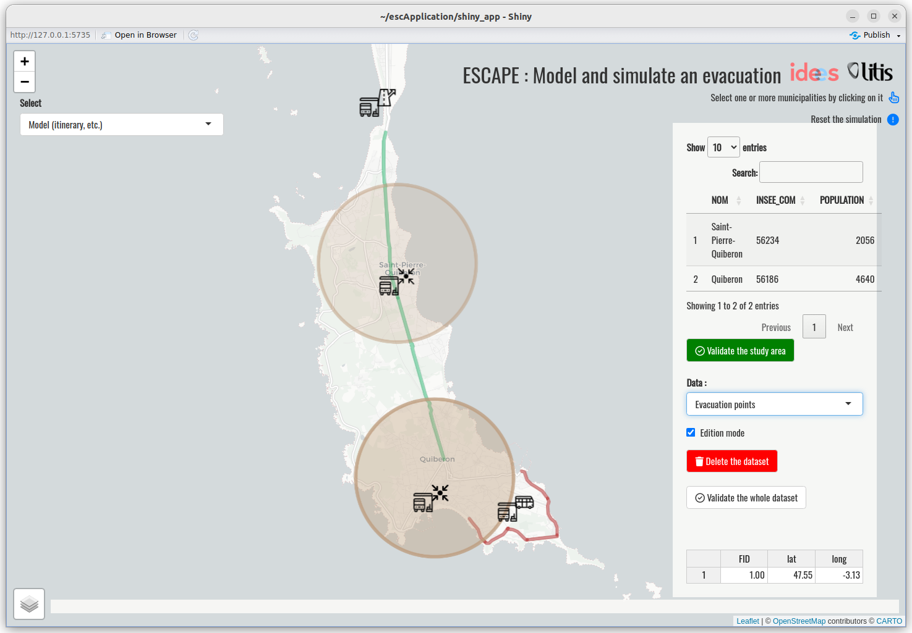
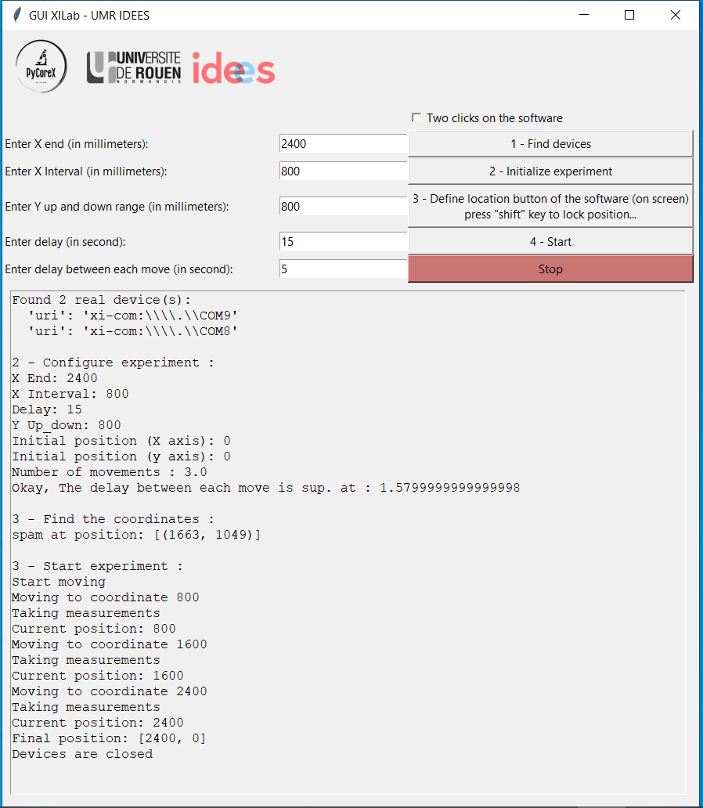
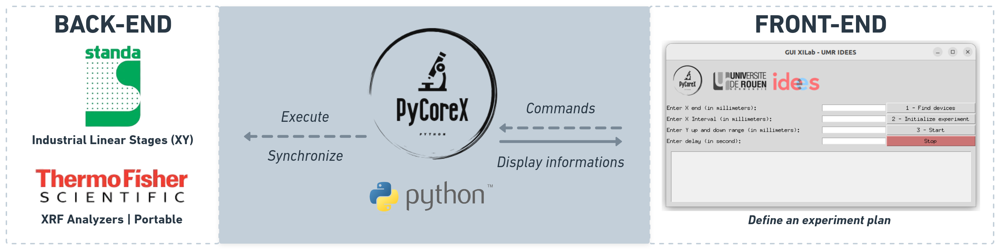
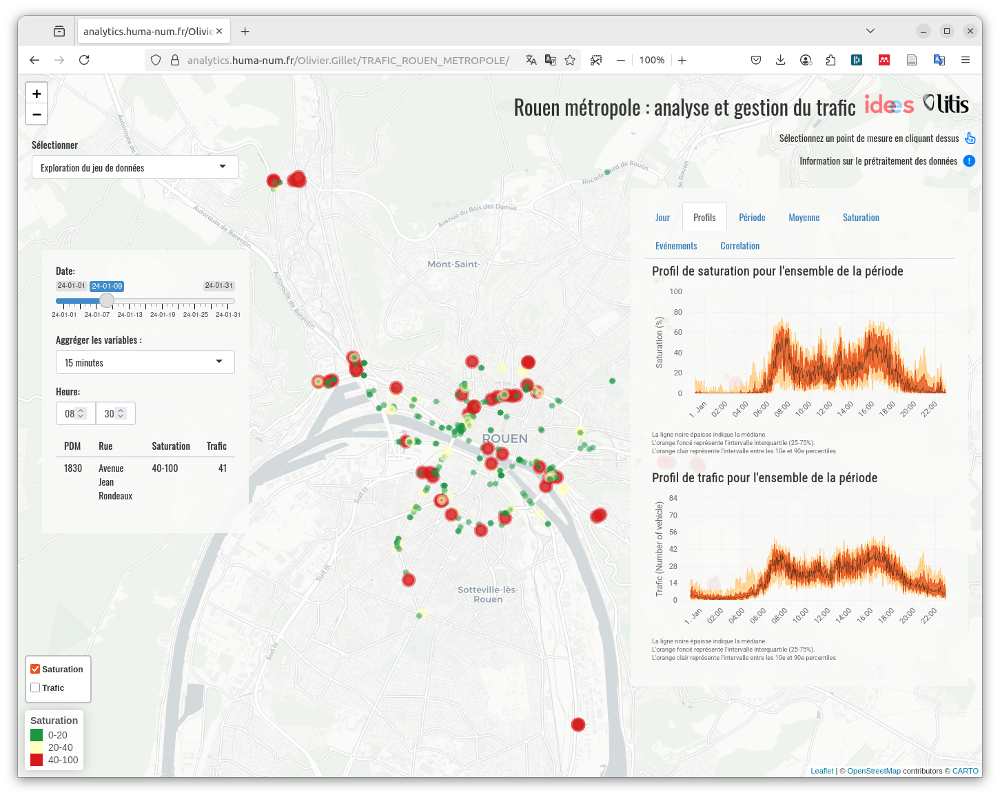
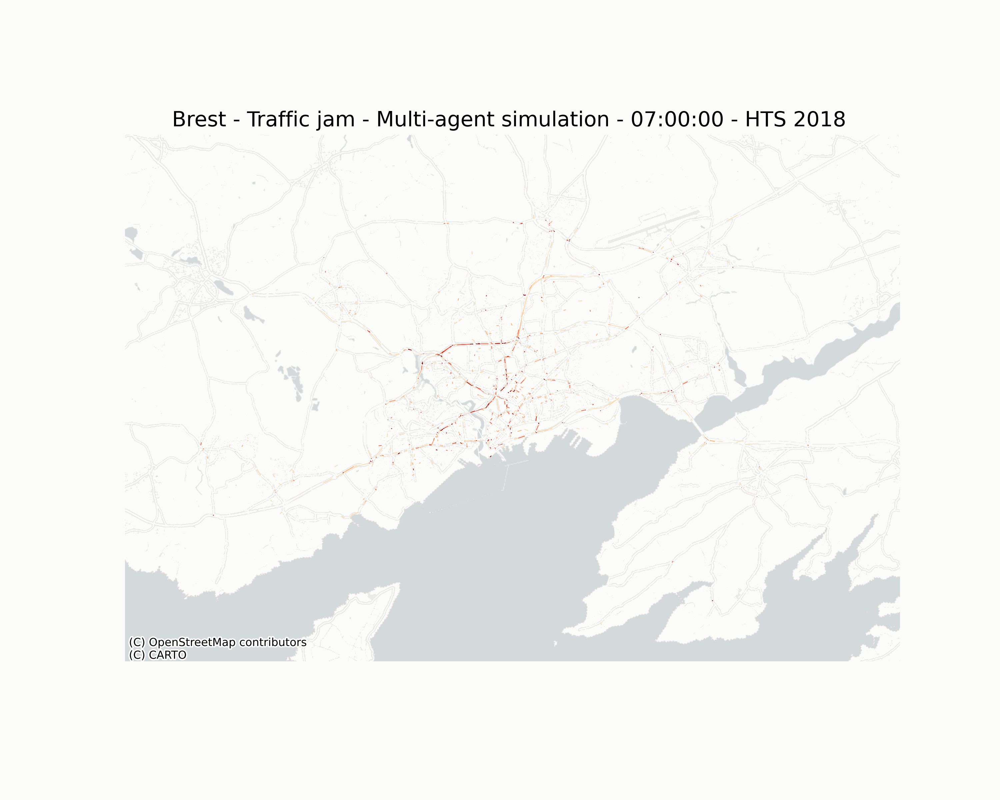
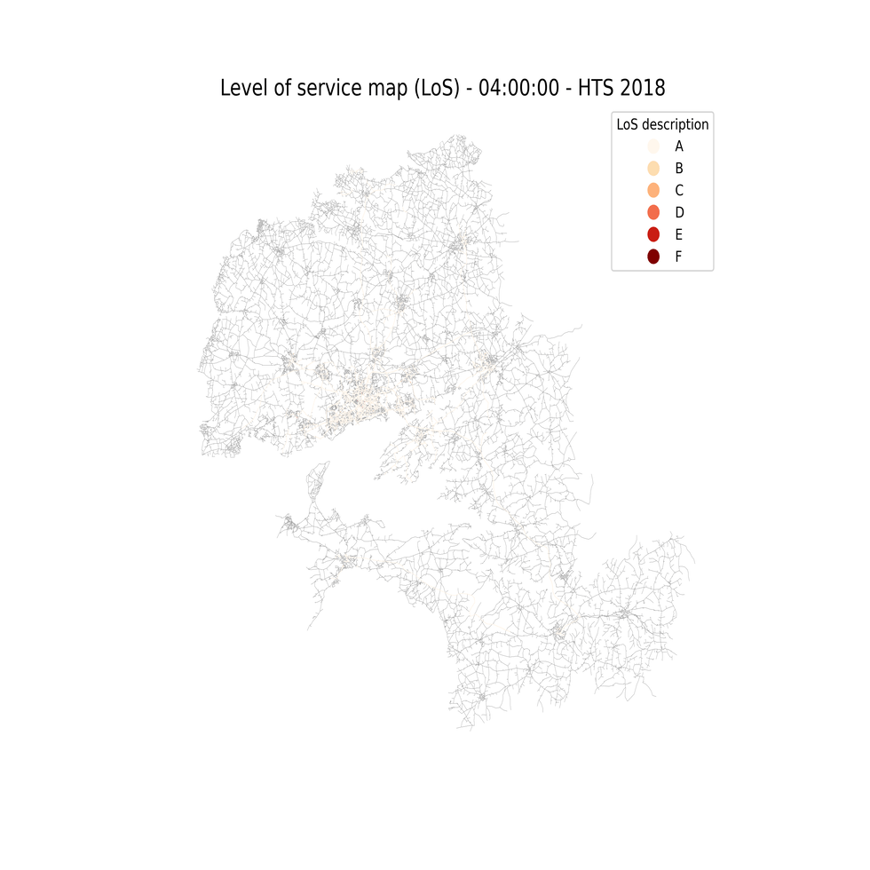
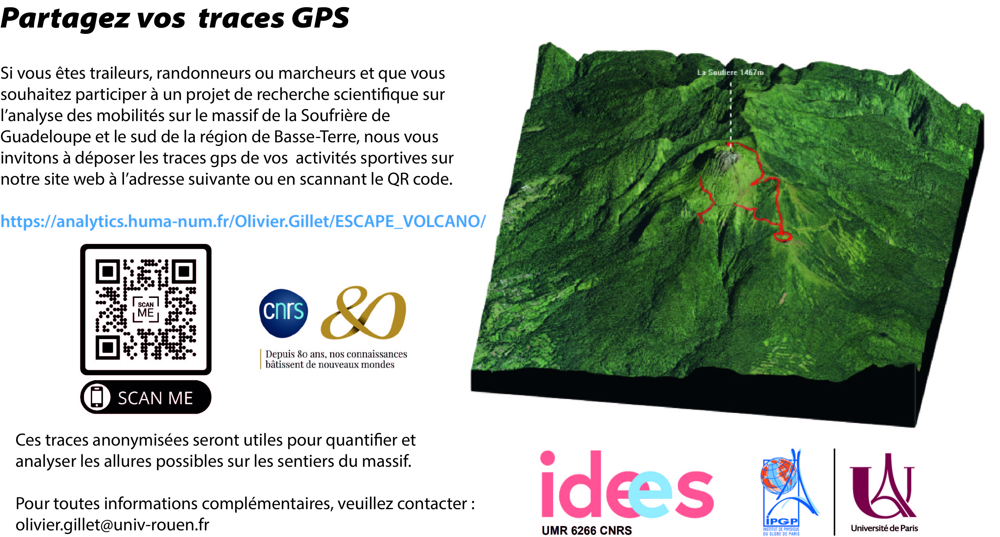
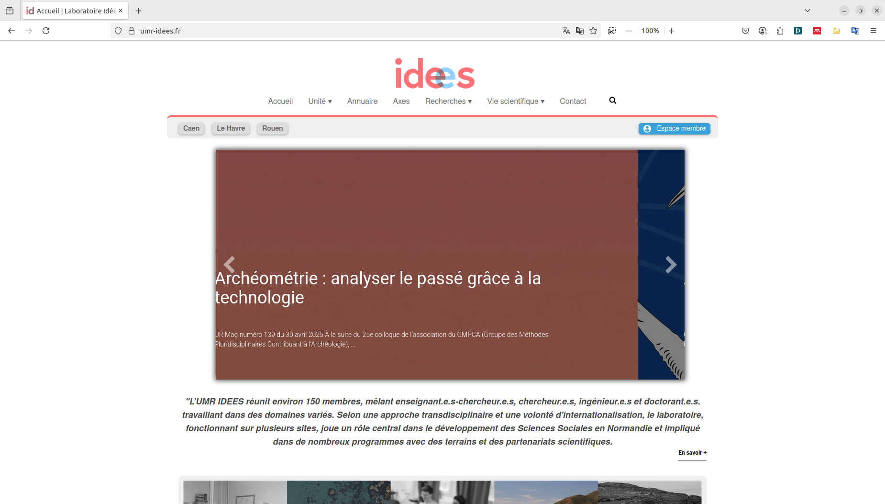
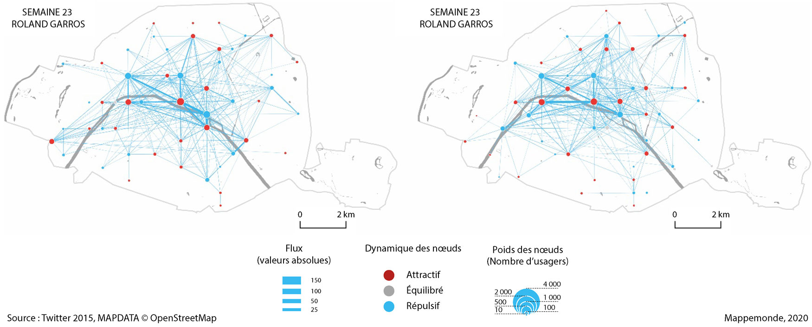

# **ESCAPE NoCode**

Développement d'une solution logicielle R-Shiny pour modéliser et simuler des évacuations en NoCode avec le système ESCAPE.



# **Projet de robotique**

Solution logicielle pour automatiser la prise de mesures avec un analyseur à fluorescence X sur des carottes sédimentaires (Python).





# **Analyse du trafic routier**

Application R-Shiny pour l'analyse du trafic routier dans la Métropole Rouen Normandie.



# **Modélisation et simulation des mobilités dans Brest Métropole**

Il s'agit d'une première utilisation, des résultats non vérifiés, du pipeline développé par Sébastien Hörl (https://eqasim.org/).





# **Accidents corporels de la circulation en Guadeloupe (2015-2019)**


# **Projet participatif : partagez vos expériences sportives sur La Soufrière**


# **Les mobilités à Déville-les-Rouen**

```{r echo=FALSE, message=FALSE, warning=FALSE}
library(leaflet)
library(sf)

load("data/DlR.RData")
map
```


# **Développement du site web de l'UMR IDEES (PHP - Kirby - Tailwind)**


# **modélisation 3D du Mont Fuji (Japon)**


# **Objets connectés et mobilité urbaine : visualiser les déplacements des usagers de Twitter avec des graphes dynamiques**
