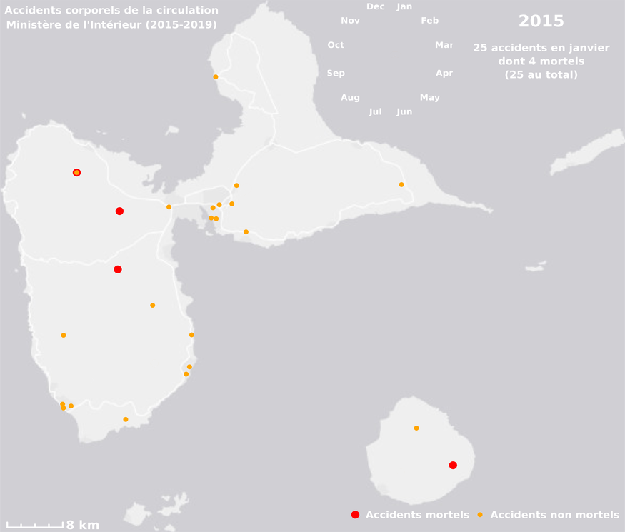

# **Modélisation et simulation des mobilités dans Brest Métropole**

Il s'agit d'une première utilisation, des résultats non vérifiés, du pipeline (https://lnkd.in/ezN6eyHM) développé par Sébastien Hörl.


# **Accidents corporels de la circulation en Guadeloupe (2015-2019)**


# **Les mobilités à Déville-les-Rouen**

```{r echo=FALSE, message=FALSE, warning=FALSE}
library(leaflet)
library(sf)

load("data/DlR.RData")
map
```

# **Mont Fuji**

