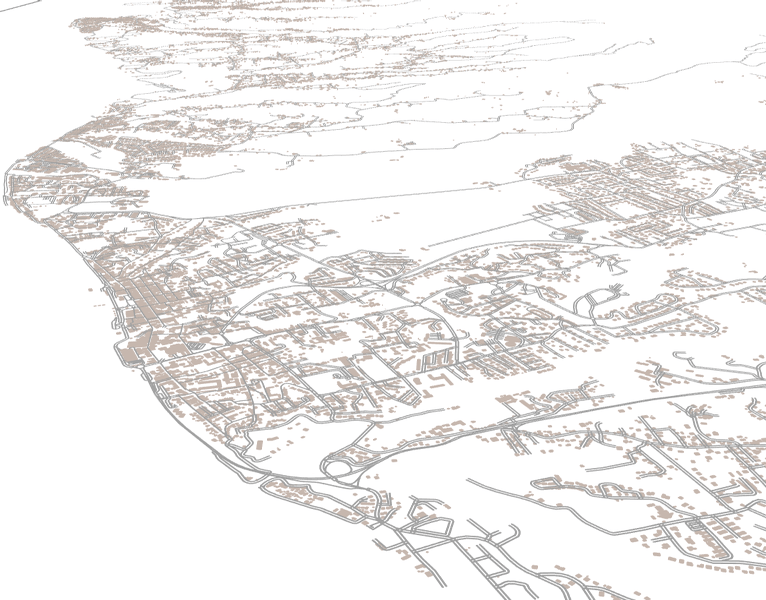

```{=html}
<style>
body {
text-align: justify}
</style>
```
### Thèse de géographie

**Modélisation et simulation des évacuations de la population basse-terrienne lors d'une crise éruptive de La Soufrière de Guadeloupe**

Le niveau d'activité et d'alerte volcanique de La Soufrière de Guadeloupe, défini par les Dispositions spécifiques ORSEC de la Guadeloupe phénomènes volcaniques de 2018, est actuellement au niveau jaune (vigilance) depuis juillet 1999. Depuis mai 2018, l'Observatoire Volcanologique et sismologique de Guadeloupe - Institut de Physique du Globe de Paris a renforcé la surveillance du fait d'une recrudescence d'activité au sein de ce niveau jaune de vigilance. Toute éruption future de la Soufrière présente, à différentes échelles d'intensité, d'espace et de temps des risques non négligeables, voire majeurs pour les populations. Bien souvent la seule protection possible contre de telles manifestations, potentiellement violentes, est alors de quitter la zone de danger. L'évacuation, à l'instar du risque volcanique, est influencée par des dynamiques sociales complexes. Si le choix de la tactique d'évacuation de la population (e.g partielle, totale, synchrone, asynchrone) est fonction de la crise éruptive et des capacités d'anticipation ("prévisions") de l'Observatoire Volcanologique et sismologique de Guadeloupe, la décision stratégique d'évacuer est du ressort de l'autorité publique. C'est le préfet qui est responsable du plan d'évacuation et la réussite de l'évacuation, quelle que soit sa forme, repose sur la stratégie globale de gestion du risque ainsi que sur la perception qu'a le public du risque volcanique. La réalité complexe des systèmes volcaniques et de leurs éruptions se traduit par un degré élevé d'incertitude sur le futur de la crise éruptive. Cette complexité oblige à une adaptation constante dans l'élaboration des stratégies d'évacuation et de prévention qui doivent tenir compte de ces incertitudes épistémiques et aléatoires. Face aux défis posés par les crises éruptives sur le territoire de la Guadeloupe, la gestion du risque requiert une planification minutieuse et des exercices de gestion de crise en grandeur nature afin d'évaluer les verrous éventuels et les dangers d'une évacuation. En raison des coûts humains et des ressources nécessaires, il est extrêmement difficile de réaliser des exercices grandeur nature pour préparer les autorités et la population à une éventuelle évacuation. La simulation informatique à base d'agents se présente alors comme un outil privilégié pour se substituer à ces exercices. Dans ce contexte, une recherche pluridisciplinaire a été menée, allant de la technique informatique aux théories du comportement humain en passant par la modélisation des processus volcaniques de La Soufrière, pour simuler l'évacuation des populations exposées du sud de la région Basse-Terre (Guadeloupe, France). Ainsi, une série de scénarios éruptifs et d'évacuation ont été élaborés, simulés et explorés via la plate-forme de simulation à base d'agents GAMA et l'extension logicielle ESCAPE. Selon des logiques de scénarisation "How-to" et "What-if", le modèle tente d'explorer les effets d'une des principales zones d'ombre des plans d'évacuation que sont les effets de décisions individuelles lors d'une crise éruptive de La Soufrière afin d'évaluer les différentes stratégies d'évacuation de Basse-Terre. Au-delà de démontrer l'efficacité de la suite logicielle ESCAPE pour simuler les situations d'urgence, les différents scénarios d'aléas et d'évacuation mettent en lumière les défis auxquels les instances gouvernementales seront confrontées lors d'une future crise éruptive de La Soufrière et apportent quelques éléments de réflexion. Ces cinq scénarios tentent de répondre à différentes questions de recherche liées aux évacuations. Ils ont été élaborés selon une logique analytique, où chacun découle de ce qui le précède. Ils suivent également une logique d'imbrication d'échelle d'analyse, passant d'une échelle macroscopique à microscopique. L'analyse des résultats de ces scénarios indique surtout qu'il est impératif de concilier planification rigoureuse et adaptabilité en synergie avec les caractéristiques des phénomènes éruptifs pour atteindre une gestion optimale du risque lors d'une évacuation qu'elle soit réactive ou préventive.

### Jury

**Directeur** : E. Daudé,\
**Co-directeur** : J-C. Komorowski\
**Rapporteur .rice** : J. Dugdale, F. Leone\
**Examinateur .rice** : D. Provitolo, D. Mouralis, M. Reuillon P. Tranouez

### Date et adresse

**Jeudi 8 février 2024 à 08h30\
**Campus de Mont-Saint-Aignan\
Bâtiment Freinet, salle F106\
76451 Mont-Saint-Aignan

### Lien de visioconférence

Disponible mercredi soir

**Liens supplémentaires**\
[Présentation du projet ESCAPE](https://slides.com/gilletolivier/jfsma_2023-bc1101/scroll?chrome=hidden)


